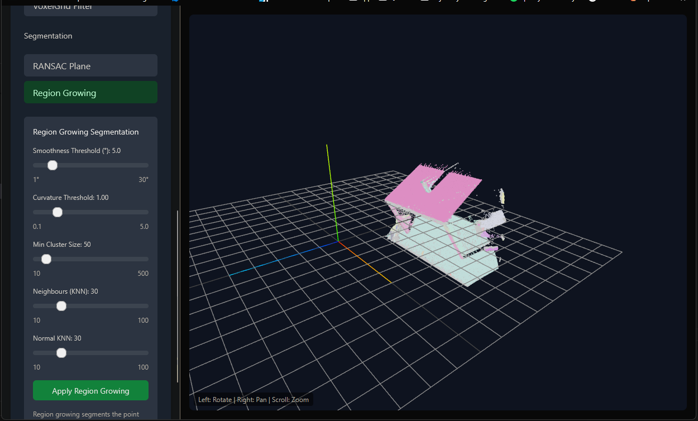
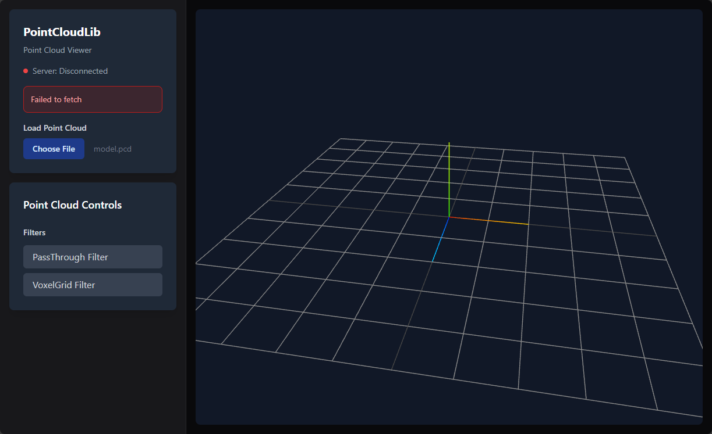
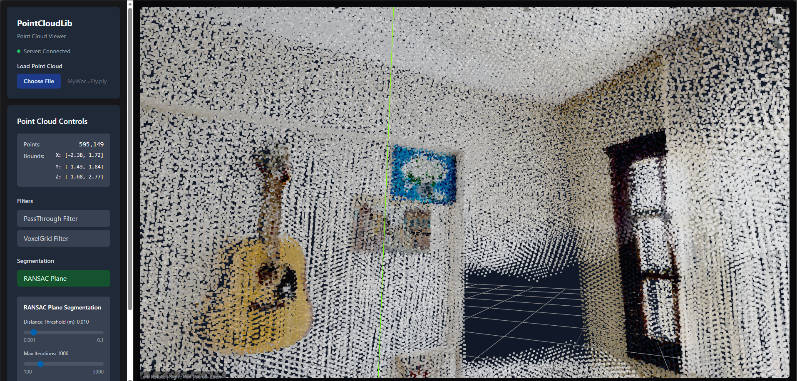

# What PointCloudLib application does ?
A PointCloudViewer UI for visualizing PCD and PLY files, with support for filtering and segmentation methods such as RANSAC, Region Growing, and Clustering

# Installation 

UI (Frontend) Side [In powershell]
- ```cd ~/PointCloudlib/ui```

- ```docker build -t pointcloudlib-ui .```
  
[//]: # "```docker build --build-arg NEXT_PUBLIC_API_URL=http://localhost:5050/api -t pointcloudlib-ui .```"

- ```docker run -p 3000:3000 pointcloudlib-ui``` or
- ```docker run -d --name pointcloudlib-ui -p 3000:3000 pointcloudlib-ui```

- ```In web browser paste it-> http://localhost:3000 ```

Yey! (Visuals)


<!--  -->


Server (Backend) Side
- ```cd ~/PointCloudlib```


- ```docker build -t pointcloudlib-server .```

- ```docker run -p 5050:5050 pointcloudlib-server pointcloudlib-ui```or
- ```docker run -p 5050:5050 pointcloudlib-server```


Test: 
- ```curl http://localhost:5050/api/health```


To:Do's 
---
    - Add move/rotate functions to obj feat
    - Add colorful 3d viewer feat
    - Add extra filters
    - Add clusterings feat
    - Add segmentation feat

## Architecture Diagram
```
┌─────────────────────────────────────────────────────────────────┐
│                    Next.js + Tailwind UI                        │
│  ┌─────────────┐  ┌──────────────┐  ┌────────────────────────┐  │
│  │ FileUpload  │  │ ControlPanel │  │ PointCloudViewer       │  │
│  │ Component   │  │ Filters/Seg  │  │ (@react-three/fiber)   │  │
│  └──────┬──────┘  └──────┬───────┘  └──────────┬─────────────┘  │
│         └────────────────┴─────────────────────┘                │
│                          │ HTTP (fetch)                         │
└──────────────────────────┼──────────────────────────────────────┘
                           │ localhost:5050
┌──────────────────────────┼──────────────────────────────────────┐
│                   C++ HTTP Server (cpp-httplib)                 │
│  ┌───────────────────────┴───────────────────────────────────┐  │
│  │ POST /api/load   → PointCloudIO::load()                   │  │
│  │ POST /api/filter → PassThroughFilter/ OtherFilters        │  │
│  │ GET  /api/points → Serialization::toJSON()                │  │
│  └───────────────────────┬───────────────────────────────────┘  │
└──────────────────────────┼──────────────────────────────────────┘
                           │
┌──────────────────────────┼──────────────────────────────────────┐
│                     PCL Processing Core                         │
│  ┌────────────┐  ┌────────────┐  ┌─────────────────────────┐    │
│  │ io/        │  │ filters/   │  │ types/                  │    │
│  │ load/save  │  │ cluster/   │  │ PointXYZRGB             │    │
│  │ PCD/PLY    │  │ segment    │  │                         │    │
│  └────────────┘  └────────────┘  └─────────────────────────┘    │
└─────────────────────────────────────────────────────────────────┘
```

## Dependencies
| Component | Package | Version |
|-----------|---------|---------|
| PCL | `pcl` (vcpkg) | 1.15.x |
| HTTP Server | `cpp-httplib` (vcpkg) | latest |
| JSON | `nlohmann-json` (vcpkg) | 3.x |
| Testing | `gtest` (vcpkg) | latest |
| React | `react` (npm) | 19.x |
| 3D | `@react-three/fiber` (npm) | 9.x |
| Styling | `tailwindcss` (npm) | 4.x |
